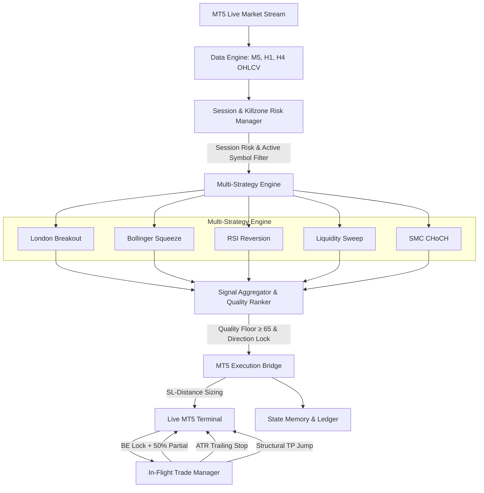

# MERIDIAN FX — Institutional Multi-Asset Trading Engine

```
    __  ___          _     ___            
   /  |/  /__  _____(_)___/ (_)___ _____  
  / /|_/ / _ \/ ___/ / __  / / __ `/ __ \ 
 / /  / /  __/ /  / / /_/ / / /_/ / / / / 
/_/  /_/\___/_/  /_/\__,_/_/\__,_/_/ /_/  

       Multi-Pair Direct Execution Trading Bot
```

[](https://www.python.org/)
[](https://www.mql5.com/)
[](LICENSE)
[](#system-architecture)

---

## Executive Summary

**Meridian FX** is an institutional-grade, multi-pair direct execution algorithmic trading engine built for MetaTrader 5 (MT5). Engineered for high-probability execution across major Forex currency pairs, Meridian combines session-aware market structure analysis, multi-timeframe trend alignment, and a 5-phase in-flight trade management system.

Unlike legacy statistical arbitrage engines that trade synthetic pair spreads incurring double transaction costs, **Meridian 2.0** evaluates market structure across individual currency pairs directly—executing single-order entries with exact broker-side stop-losses, dynamic take-profits, break-even locks, and ATR trailing stops.

---

## Key Architectural Pillars

### 1. Multi-Strategy Technical Engine
Meridian operates a modular strategy suite covering diverse market conditions:
- **London Breakout Trap**: Asian accumulation range mapping with zero-latency stop-trap placement during the London killzone open.
- **Bollinger Squeeze Breakout**: Identifies volatility compression (< 20th percentile bandwidth) on M5 and trades confirmed expansion breakouts.
- **RSI Reversion with Trend Guard**: Mean-reversion scalping on extreme RSI readings (≤30 / ≥70), gated by H1 50-EMA trend direction and M15 ADX trend strength filters.
- **Liquidity Sweep (Judas Swing)**: Detects institutional stop-hunting above Relative Equal Highs (BSL) and Equal Lows (SSL) with limit-order fade entries.
- **SMC Change of Character (CHoCH)**: Tracks structural pivot breaks and sets limit orders at 50% midpoint of origin Order Blocks.

### 2. 5-Phase In-Flight Trade Lifecycle
Every active trade is managed dynamically by an automated position lifecycle manager:
1. **Precision Entry**: SL-distance risk-adjusted position sizing ($Lots = \frac{Balance \times Risk\%}{SL\_Dist \times Contract\_Size}$).
2. **Break-Even Lock & Partial Close**: Automatically adjusts Stop Loss to Entry + fee offset and closes 50% of the position volume when unrealized profit reaches 50% of the TP distance.
3. **ATR Trailing Stop**: Dynamically trails the Stop Loss by $2.0 \times \text{ATR}$ on winning trades, securing accrued profits without suffocating momentum.
4. **Structural TP Extension**: Scans H1/M15 structural pivots when price approaches target, extending Take Profit to the next structural level while locking SL at the former TP level.
5. **Clean Exit**: Resolves trades cleanly via hard SL, extended TP, trailing SL, or scheduled news/weekend liquidations.

### 3. Institutional Risk Defenses
- **Multi-Timeframe Trend Alignment**: Multi-timeframe trend filters prevent counter-trend execution against H1/H4 macro flows.
- **Session-Aware Killzone Activation**: Restricts active symbol universes and scales risk according to global session liquidity (Asian, London, NY Overlap, NY PM).
- **Dynamic Spread Calibration**: Samples broker spreads on startup and rejects order entries during spread spikes exceeding $1.5\times$ baseline.
- **Realtime News Blackout**: Integrates live news feed scraping to block entries within 60 minutes of high-impact macroeconomic events.
- **Persistent State Recovery**: Atomic JSON state tracking (`data/meridian_state.json`) guarantees immediate recovery of tickets, SL levels, and partial exit states across restarts.

---

## System Architecture



---

## Primary Forex Universe

Meridian actively monitors and trades 10 core Forex pairs:

| Symbol | Primary Liquidity Session | Standard Spread Target |
|---|---|---|
| `EURUSD` | London / NY Overlap | Tight (< 1.2 pips) |
| `GBPUSD` | London / NY Overlap | Moderate (< 1.5 pips) |
| `USDJPY` | Asian / NY Session | Tight (< 1.2 pips) |
| `USDCHF` | European Session | Tight (< 1.5 pips) |
| `AUDUSD` | Asian / NY Overlap | Moderate (< 1.6 pips) |
| `NZDUSD` | Asian Session | Moderate (< 1.8 pips) |
| `USDCAD` | NY Session | Tight (< 1.4 pips) |
| `EURGBP` | European Session | Moderate (< 1.6 pips) |
| `EURJPY` | European / Asian | Moderate (< 1.8 pips) |
| `GBPJPY` | London / Asian | Variable (< 2.2 pips) |

---

## Project Structure

```
meridian/
├── config.py                 # Central bot configuration & risk parameters
├── meridian.py               # Main bot execution orchestrator & tick loop
├── run_backtest.py           # Historical portfolio backtest runner
├── connectors/
│   └── mt5_bridge.py         # MT5 terminal bridge, order execution & trade manager
├── core/
│   ├── aggregator.py         # Candidate signal ranker & Quality Score filter
│   ├── forex_pairs.py        # Forex symbol definitions & pip specifications
│   ├── math_utils.py         # Mathematical indicators (ATR, RSI, Bollinger Bands, EMA)
│   ├── news_filter.py        # High-impact news blackout filter
│   ├── performance_tracker.py# Trade outcome logger & Kelly risk adapter
│   ├── realtime_news.py      # ForexFactory & RSS news scraper
│   ├── regime_detector.py    # ADX & EMA trend regime detector
│   ├── session_manager.py    # Session killzones & dynamic risk scaling
│   ├── spread_guard.py       # Spread calibration & broker rollover guard
│   ├── state_manager.py      # Thread-safe persistent JSON state engine
│   └── trade_logger.py       # CSV trade ledger & summary report generator
├── engine/
│   ├── strategies/           # Modular strategy implementations
│   │   ├── base.py           # Strategy interface contract
│   │   ├── bb_breakout.py    # Bollinger Squeeze Breakout Strategy
│   │   ├── liquidity_sweep.py# Judas Swing Liquidity Sweep Strategy
│   │   ├── london_breakout.py# London Killzone Breakout Strategy
│   │   ├── rsi_reversion.py  # RSI Mean Reversion Strategy
│   │   └── smc_choch.py      # Smart Money CHoCH Strategy
│   ├── backtester.py         # Strategy backtesting engine
│   ├── data_feed.py          # Candle data fetcher
│   ├── execution.py          # Execution state manager
│   └── risk_manager.py       # Portfolio risk engine
└── README.md
```

---

## Quick Start Guide

### Prerequisites
- Operating System: **Windows 10 / 11** or **Windows Server 2019+**
- Environment: **Python 3.10+**
- Broker Terminal: **MetaTrader 5** (logged into a live or demo broker account with Algo Trading enabled)

### 1. Installation
Clone the repository and install required dependencies:
```bash
git clone https://github.com/YOUR_USERNAME/meridian.py.git
cd meridian
pip install -r requirements.txt
```

### 2. Configuration
Review and customize trading parameters in `config.py`:
```python
MAX_SINGLE_TRADE_RISK_PCT = 2.0  # Risk 2.0% per trade
MAX_DAILY_LOSS_PERCENT = 3.0    # 3.0% daily equity halt
BE_TRIGGER_PCT = 0.50            # Lock BE at 50% TP distance
PARTIAL_CLOSE_PCT = 0.50         # Scale out 50% volume at BE
```

### 3. Launch Execution
Ensure MetaTrader 5 is running, then execute the main engine:
```bash
python meridian.py
```

---

## Risk Disclaimer

> **IMPORTANT NOTICE**: Trading foreign exchange on margin carries a high level of risk and may not be suitable for all investors. The high degree of leverage can work against you as well as for you. Before deciding to trade foreign exchange or any other financial instrument, you should carefully consider your investment objectives, level of experience, and risk appetite. Past performance is not indicative of future results.

---

## License

Distributed under the **Apache License 2.0**. See [`LICENSE`](LICENSE) for details.
