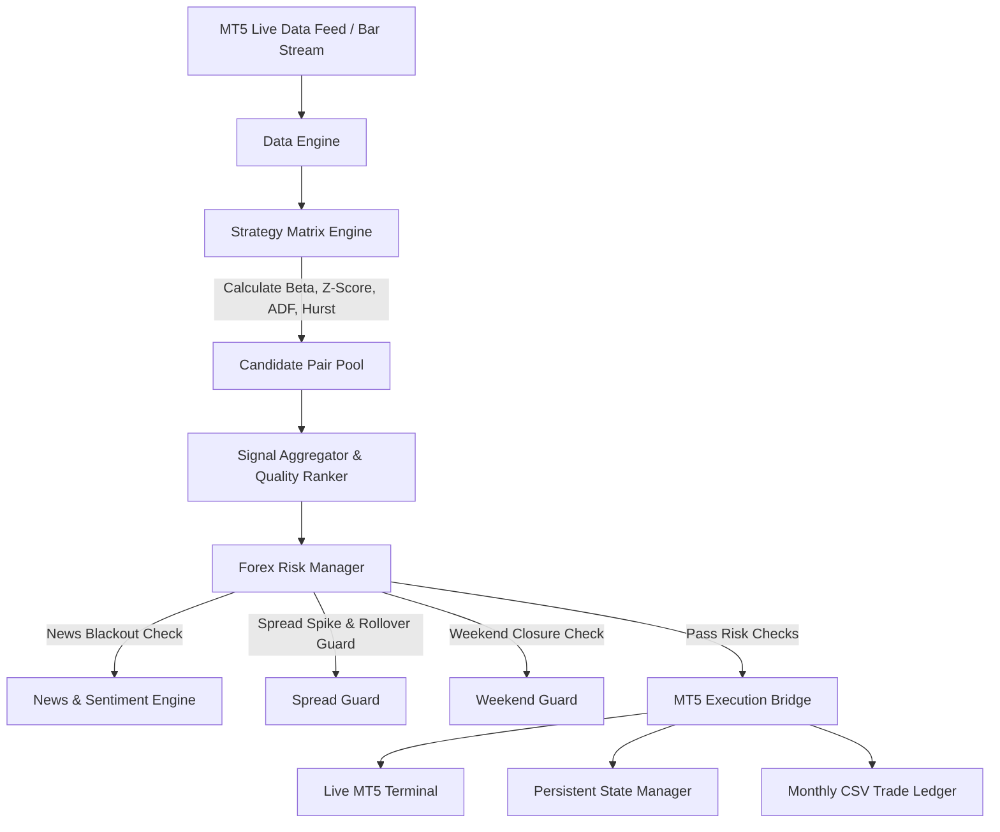

# MERIDIAN FX — Multi-Currency Statistical Arbitrage Engine

```
    __  ___          _     ___            
   /  |/  /__  _____(_)___/ (_)___ _____  
  / /|_/ / _ \/ ___/ / __  / / __ `/ __ \ 
 / /  / /  __/ /  / / /_/ / / /_/ / / / / 
/_/  /_/\___/_/  /_/\__,_/_/\__,_/_/ /_/  

       Multi-Currency Statistical Arbitrage Engine
```

[](https://www.python.org/)
[](https://www.mql5.com/)
[](LICENSE)

**Meridian FX** is an institutional-grade, multi-currency statistical arbitrage and pair trading engine designed for Forex markets. It scans a 10-symbol Forex universe ($\rightarrow$ 45 pair combinations), dynamically tracks cointegration relationships via adaptive **Kalman Filters**, ranks trade opportunities through a multi-factor **Signal Aggregator**, and executes synchronized dual-leg orders directly through **MetaTrader 5 (MT5)**.

---

## Key Features & Core Upgrades

### 1. Dynamic Cointegration & Kalman Filtering
- **Dynamic Hedge Ratio Estimation**: Implements adaptive Kalman Filtering ($\beta_t$) to update spread calculations ($S_t = P_A - \beta_t P_B$) on every single tick.
- **Engle-Granger Cointegration**: Performs Augmented Dickey-Fuller (ADF) stationarity tests ($p < 0.05$) to verify cointegration before entry.
- **Ornstein-Uhlenbeck (OU) Half-Life & Hurst Exponent**: Restricts entries to strongly mean-reverting series ($H < 0.45$, Half-life $\le 20$ bars).

### 2. Multi-Factor Signal Aggregator (`core/aggregator.py`)
- Evaluates all 45 pair combinations simultaneously every tick.
- Ranks candidate signals using a composite **Quality Score** (ADF $p$-value, Hurst exponent, Half-life speed, VWAP/RSI alignment, and Realtime News sentiment).
- Selects the **Top 3 highest-probability setups** while enforcing currency exposure caps (maximum 2 active trades per currency).

### 3. Persistent Memory & State Recovery (`core/state_manager.py`)
- Thread-safe persistent JSON memory (`data/meridian_state.json`) with atomic file replacements.
- Automatically recovers active position tickets, entry Z-scores, and 50% partial exit states across Python restarts, crashes, or system reboots.

### 4. Automated Trade Ledger & Monthly Reports (`core/trade_logger.py`)
- Automatically queries MT5 execution deals by magic number (`888999`).
- Exports monthly CSV ledgers (`reports/meridian_ledger_{account}_{month}.csv`) and performance summary text reports (`reports/meridian_report_{account}_{month}.txt`).

### 5. Institutional Risk & Execution Defenses
- **Dynamic Spread & Rollover Guard (`core/spread_guard.py`)**: Blocks order entries during the daily broker rollover gap (21:00–22:00 UTC) and when broker spreads exceed $2.5\times$ baseline.
- **Weekend Sleep Mode**: Automatically detects market closure (Friday 21:00 UTC to Sunday 22:00 UTC) and enters a zero-noise idle state.
- **Realtime News Blackout Filter (`core/news_filter.py`)**: Scrapes live ForexFactory news calendars and RSS feeds, blocking entries within 60 minutes of high-impact events across all 4 currencies involved in a pair trade.
- **50/50 Partial Exit Scaling**: Scales out 50% of position size at $Z = \pm 1.0$ and moves stop-loss to Break-Even.

---

## 6-Month Real MT5 Portfolio Backtest Results

Verified over **12,000 real M15 candles** pulled directly from MT5 (Exness Account #436506749):

| Metric | Benchmark Result |
|---|---|
| **Historical Horizon** | **~6 Months (12,000 M15 candles from MT5)** |
| **Initial Starting Balance** | **$541.79** *(Live MT5 Account Balance)* |
| **Final Account Equity** | **$642.14** |
| **Net Portfolio Profit** | **+$100.35** |
| **Total Net Return** | **+18.52%** |
| **Total Trades Executed** | **274 trades** |
| **Overall Win Rate** | **50.4%** |
| **Profit Factor** | **1.21** |
| **Sharpe Ratio** | **1.86** |
| **Max Portfolio Drawdown** | **-8.35%** *(Max dollar drawdown was only -$45.80)* |

---

## System Architecture



---

## Project Structure

```
meridian/
├── config.py                 # Central bot configuration & risk parameters
├── meridian.py               # Main headless bot entry point & execution loop
├── run_backtest.py           # 6-month MT5 historical portfolio backtest runner
├── connectors/
│   ├── mt5_bridge.py         # MT5 terminal connector & dual-leg order execution
├── core/
│   ├── aggregator.py         # Multi-factor signal aggregator & candidate ranker
│   ├── forex_pairs.py        # Forex symbol definitions & lot sizing metadata
│   ├── math_utils.py         # Engle-Granger ADF, Kalman Filter, Hurst, RSI, VWAP
│   ├── news_filter.py        # 4-currency economic news blackout filter
│   ├── performance_tracker.py# Empirical win-rate feedback engine
│   ├── realtime_news.py      # Live RSS & ForexFactory news scraper
│   ├── regime_detector.py    # ADX market trend regime detector
│   ├── session_manager.py    # Asian, London, NY session Z-threshold adapter
│   ├── spread_guard.py       # Dynamic spread spike & 21:00 UTC rollover guard
│   ├── state_manager.py      # Thread-safe persistent JSON state memory
│   └── trade_logger.py       # Monthly CSV trade ledger & text summary exporter
├── engine/
│   ├── backtester.py         # Pair-level backtesting engine
│   ├── data_feed.py          # Real MT5 candle fetcher & synthetic generator
│   ├── execution.py          # Paper OMS & partial scale-out manager
│   ├── risk_manager.py       # Multi-layered institutional risk manager
│   └── strategy.py           # Pair matrix cointegration scanner
└── README.md
```

---

## Quick Start Guide

### Prerequisites
- Windows 10/11
- Python 3.10+
- MetaTrader 5 Terminal installed and logged into your broker account

### Installation
```bash
git clone https://github.com/YOUR_USERNAME/meridian.py.git
cd meridian
pip install -r requirements.txt  # pandas, numpy, statsmodels, MetaTrader5
```

### Running the Live Bot
```bash
python meridian.py
```

### Running the 6-Month Portfolio Backtest
```bash
python run_backtest.py
```

---

## License

Distributed under the MIT License. See `LICENSE` for more information.
